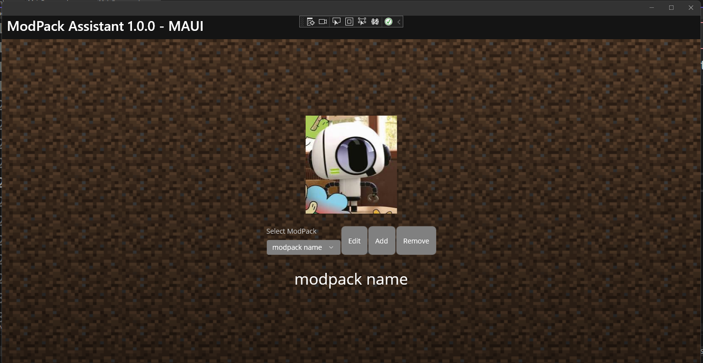
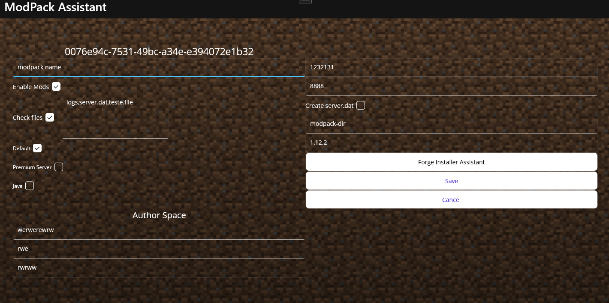

# Boberto Launcher ModPack Editor 

### This repository is a refactor and new release of https://github.com/brutalzinn/CriadorDeMods

# Features

- Client/Server creator foreach modpack
- ModPack editor especify for easily mod list creation
- Integration with api-authentication-boberto 
- Integration with Discord Boberto Bot for authentication and gets especify ApiKey with needs authorizations
- Integration with api-minecraft-server-modpack-manager
- Semi automation for Forge Installation

# Views

.

.
